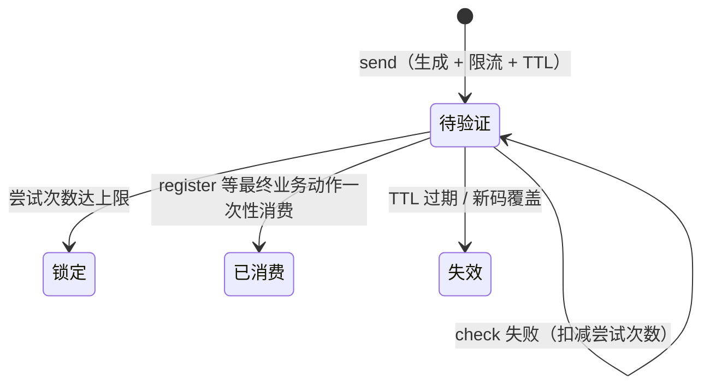
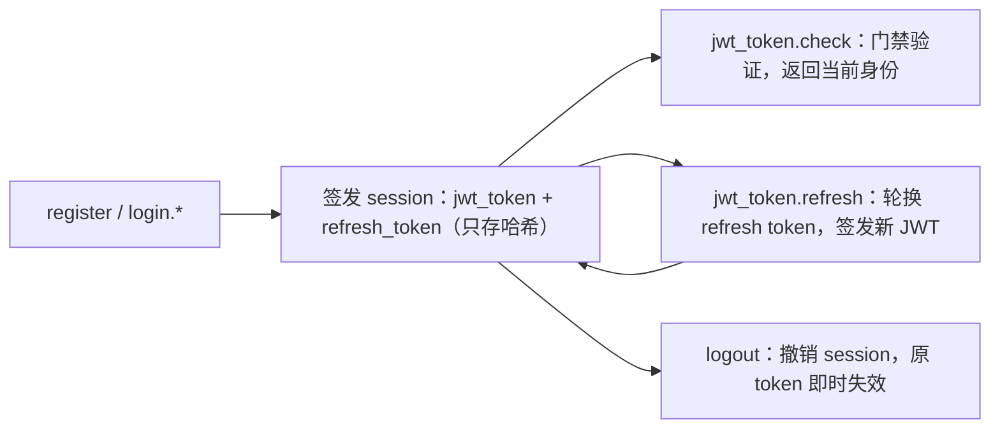

[← 返回 README](../README.md)

<!-- TOC -->

- [1. Auth 域定位与边界](#1-auth-域定位与边界)
- [2. 业务流转](#2-业务流转)
- [3. 方法契约](#3-方法契约)
    - [3.1. auth.verify_code.send.email](#31-authverify_codesendemail)
    - [3.2. auth.verify_code.check.email](#32-authverify_codecheckemail)
    - [3.3. auth.verify_code.send.sms](#33-authverify_codesendsms)
    - [3.4. auth.verify_code.check.sms](#34-authverify_codechecksms)
    - [3.5. auth.register](#35-authregister)
    - [3.6. auth.login.email](#36-authloginemail)
    - [3.7. auth.login.phone](#37-authloginphone)
    - [3.8. auth.logout](#38-authlogout)
    - [3.9. auth.jwt_token.check](#39-authjwt_tokencheck)
    - [3.10. auth.jwt_token.refresh](#310-authjwt_tokenrefresh)
- [4. 数据与并发纪律](#4-数据与并发纪律)
- [5. 验收边界](#5-验收边界)
- [6. 实现进度](#6-实现进度)

<!-- /TOC -->

# 1. Auth 域定位与边界

Auth 是 **API 准入域**：实现整体位于 `api/api_auth`（不在 `ability` 树内），涵盖通信之后的权限准入——验证码、注册、登录、session/JWT 与统一准入门禁；`ability` 只承载业务功能实现。文件名沿用 `ability_auth.md` 以保持链接稳定。

预期目的：提供真实可用、可失效、可审计且不泄露敏感身份信息的验证码、登录和 token 链路。Auth 负责认证编排；User 数据、密码变更和手机号绑定属于 User 域。

User 边界：绑定手机号保存在 `users.bind_phone`，未绑定为 `NULL`。Auth 通过 User 包方法取得对应用户，不直接查询 User model，也不保存或暴露 `PasswordHash`；注册和登录只调用 User 包方法。手机号绑定、解绑、修改与密码变更属于 User 域，完整边界见 [`ability_user.md`](ability_user.md)。

# 2. 业务流转

验证码状态机（按规范化 `recipient` 键控、渠道无关）：



`check` 成功只检查、不消费，也不产生授权结果；最终业务动作仍须重新校验并一次性消费。

Session / JWT 生命周期：



# 3. 方法契约

业务错误统一复用 API 通用错误码，不增加独立错误码区间：身份认证和 token 校验失败统一 `API_PERMISSION_DENIED`，验证码或账户输入不可用统一 `API_INVALID_ARGUMENTS`，不得通过错误码或消息暴露邮箱、手机号或账户是否存在。邮件供应商、数据库或内部状态故障属于服务错误，不伪装成业务成功；可预期业务失败经统一 MCP `CallToolResult`（`isError=true` + `error_code`/`error_msg`）返回，不得使用协议错误冒充业务状态。

入参 schema 权威见 [`api_methods.md`](api_methods.md)。

## 3.1. auth.verify_code.send.email

发送邮箱验证码（Public 方法）。

```json
{ "email": "user@example.com" }
```

- 验证码统一存入 `VerificationCode`，以规范化后的 `recipient` 绑定接收目标；Email 和 SMS 只区分发送通道，不拆分验证码表。
- 邮件投递收口在单一函数内按 `email.provider` 配置选择供应商。

## 3.2. auth.verify_code.check.email

检查邮箱验证码（Public 方法）。

```json
{ "email": "user@example.com", "verify_code": "123456" }
```

- 只检查、不消费、不产生授权结果；检查失败必须扣减尝试次数，达到上限后锁定。

## 3.3. auth.verify_code.send.sms

发送短信验证码：当前明确返回 `API_METHOD_NOT_SUPPORTED`；实施时复用同一验证码状态机，只新增渠道编排与投递函数。

## 3.4. auth.verify_code.check.sms

检查短信验证码：当前明确返回 `API_METHOD_NOT_SUPPORTED`。

## 3.5. auth.register

使用邮箱验证码注册账户（Public 方法）。

```json
{
  "user_name": "yeah_dev",
  "email": "user@example.com",
  "password": "...",
  "verify_code": "123456"
}
```

- `user_name` 是注册必填主标识（全局唯一，规范化与校验见 [`ability_user.md`](ability_user.md)）；email 为绑定形态。
- 必须在同一个 GORM 事务中校验并**一次性消费**邮箱验证码、创建稳定用户身份；用户 ID 与用户名、邮箱、手机号无关。

## 3.6. auth.login.email

邮箱密码登录（Public 方法）。

```json
{ "login_method": "password", "email": "user@example.com", "password": "..." }
```

## 3.7. auth.login.phone

手机号登录（Public 方法）。

```json
{ "login_method": "password", "phone": "+8613800000000", "password": "..." }
```

- 只允许使用 `users.bind_phone` 中已验证的 canonical phone；与邮箱登录认证失败必须使用相同业务错误，不泄露身份是否存在。
- `login_method: "verify_code"` 形态当前明确返回 `API_METHOD_NOT_SUPPORTED`：

```json
{ "login_method": "verify_code", "phone": "+8613800000000", "verify_code": "123456" }
```

## 3.8. auth.logout

撤销当前登录状态。wire 必传 `jwt_token`（门禁验证并消费），撤销 context 身份对应 session；业务参数为空。

```json
{}
```

## 3.9. auth.jwt_token.check

检查 JWT token 并返回当前身份。wire 必传 `jwt_token`（门禁验证并消费）；业务参数为空。

```json
{}
```

## 3.10. auth.jwt_token.refresh

轮换 refresh token 并签发新 JWT（Public 方法，不经门禁）。

```json
{ "refresh_token": "..." }
```

- refresh token 只保存哈希；轮换和 logout 必须使用数据库事务或原子更新。

# 4. 数据与并发纪律

- 验证码不得明文落库、写日志或进入响应（唯一例外：Debug 运行模式可写 Debug 日志供本地联调，Release/Test 禁止），必须具备 TTL、尝试次数、发送间隔、小时发送上限和消费状态。
- JWT 必须固定签名算法、issuer、audience、有效期和 token 类型。
- 统一准入门禁：非 Public 方法 Execute 前经 `AuthenticateRequest` 验证 `arguments.jwt_token`，验证后即从 arguments 移除，身份经 context 下传；`jwt_token` 入参 schema 由方法注册表按非 Public 自动注入，业务注册禁止声明。
- `db.GlobalMysqlCtl` 是唯一 MySQL 入口；查询和写入使用 `MysqlDB.WithContext(ctx)`，多步写操作使用 `Transaction`；表结构以 Go model 为事实源经 `AutoMigrate` 同步，不得经另一连接池、原始 DDL、mysql CLI 或外部脚本修改。
- 邮件通道供应商由 auth 配置 `email.provider` 选择，当前仅支持 `resend`（Resend 官方 Go SDK）；配置进入 `config.FileConfig` 的 YAML/JSON/TOML 体系。
- `email` 配置块的 `provider`、`api_key`、`from`、`product_name`（邮件文案品牌名）、`verification_subject` 均为强配置：缺失或非法在配置加载层显式拒绝，不在业务代码里兜默认值。
- Auth 配置校验失败输出字段级 warning 日志（指向 `auth_cfg.xxx.yyy` 完整键路径，敏感字段只报名不报值）。
- API key、密码、验证码和 token 不得写日志、落入错误响应或以明文保存。

# 5. 验收边界

真实验收必须分别证明：

- 邮箱验证码由有效 Resend 配置成功送达。
- 邮箱验证码检查不会消费，最终注册会一次性消费。
- 注册创建 User。
- 邮箱密码登录成功。
- 已验证手机号密码登录成功。
- JWT check、refresh rotation 和 logout 失效真实可用。
- SMS 相关调用和手机号验证码登录返回 `API_METHOD_NOT_SUPPORTED`。
- 四种协议的业务失败均使用正常协议状态和相同业务返回值。

# 6. 实现进度

状态按 `TODO → IN_PROGRESS → DONE → ACCEPTED` 流转；发生争议时进入 `DISPUTED`，对齐后回到 `IN_PROGRESS`。只有 `ACCEPTED` 可以打勾。

本文档随模板携带：实现代码已随模板就位（DONE），真实验收须在实例化项目内按各自环境完成后方可 ACCEPTED。

- [ ] 🟡 DONE — Auth 配置、验证码哈希、JWT 基础实现已存在；密码哈希由 User 域持有。
- [ ] 🟡 DONE — verify_code 域包收口完成：`api_auth_verify_code` 持有 email/SMS 四方法，email provider 由 `email.provider` 配置选择（`EmailConfig` 含 `product_name` 品牌配置），配置校验失败有字段级 warning 日志。
- [ ] 🟡 DONE — 准入域整体上移：auth 六子包迁至 `api/api_auth`；APIExecuter 统一准入门禁（非 Public 方法 Execute 前验 `arguments.jwt_token`，身份经 context 下传）；业务方法删除自行鉴权样板；wire 与 `api_methods.md` 零变化。
- [ ] 🟡 DONE — 门禁参数收口：门禁验证后 `jwt_token` 即从 arguments 移除，业务层零感知；`jwt_token` 入参 schema 由方法注册表按非 Public 自动注入（业务注册声明即启动 panic）；业务包与 Async 落库不再出现 token；wire 与 `api_methods.md` 零变化。
- [ ] 🟡 DONE — Auth method 描述和实际 Execute 函数已统一注册。
- [ ] 🟡 DONE — 邮箱验证码 `send/check` 和注册消费语义已实现。
- [ ] 🟡 DONE — `auth.login.email`、`auth.login.phone` 登录语义已实现（login.phone 待手机号绑定实现后验收）。
- [ ] 🟡 DONE — `auth.jwt_token.check/refresh` 与 `auth.logout` 已接入。
- [ ] 🟡 DONE — Auth 业务失败已复用 API 通用错误码，并完成四协议 `CallToolResult` 验证。
- [ ] 🟡 DONE — 可选绑定手机号字段为 `users.bind_phone`。
- [ ] 🟡 DONE — 使用有效 Resend 配置完成真实邮箱主流程验收。
- [ ] ⬜ TODO — 使用真实已验证手机号完成密码登录验收。
