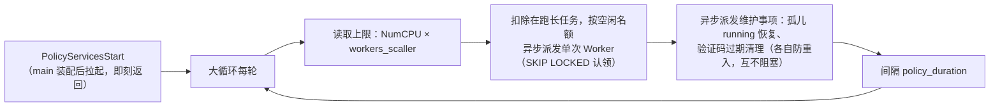

[← 返回 README](../README.md)

<!-- TOC -->

- [1. Policy 域定位与边界](#1-policy-域定位与边界)
- [2. 业务流转](#2-业务流转)
- [3. 数据与并发纪律](#3-数据与并发纪律)
- [4. 验收边界](#4-验收边界)
- [5. 实现进度](#5-实现进度)

<!-- /TOC -->

# 1. Policy 域定位与边界

`policy` 是统一策略调度域：周期从 MySQL 持久化排队区认领异步任务，限制全局同时执行数，并异步派发未尽之事恢复、周期清理等维护事项。Task 域只负责受理、持久状态与单条任务执行，不自建 Worker 池或轮询循环。

本域无对外 API 方法，不设方法契约节；对外能力经 Task 域方法（`task.get` / `task.list` / `task.cancel`）与各业务域 Async 方法体现。

# 2. 业务流转

`main.go` 在数据库迁移完成后调用 `PolicyServicesStart()`；该方法拉起内部 goroutine 后立即返回，由内部唯一大循环驱动：



Worker 不常驻、不空转：每个 Worker 只原子认领一条 `queued` 任务，执行完后释放 goroutine 与 Policy 计数名额。长任务跨越多轮时仍只占一个名额，不会因周期到达而重复执行或突破并发上限。

重启续跑：进程重启后第一轮时本地 in-flight 为空，`RequeueOrphanedTasks` 将死进程遗留的 `running` 任务恢复为 `queued`，后续由 Policy 再次认领；运行期间正常执行的任务记录在本进程 in-flight 中，不会被误恢复。进程无法从 Go 函数的中断指令处继续，恢复契约是按持久化输入重放——涉及远程服务的 `Execute` 必须持久化远程任务 ID/幂等键并自查续跑，避免重复创建远程任务。

# 3. 数据与并发纪律

配置（`config.FileConfig` 体系）：

```yaml
policy_cfg:
  policy_duration: "10s"
  workers_scaller: 5
```

- `policy_duration`：两轮派发的间隔，缺省或非法时回落 `10s`。
- `workers_scaller`：CPU 并发倍率，缺省或非法时回落 `1`。例如 2 CPU 配置 `5` 时最多同时执行 10 条异步任务。

装配纪律：

- 新增周期事项 = 对应域提供一个单次函数 + Policy 大循环追加一次异步派发。
- 单次函数不得自建周期死循环。
- 需防重入的周期任务通过独立 `atomic.Bool` 守卫，不使用全局 `WaitGroup` 阻塞其他任务。
- 普通 API 由协议服务、Go runtime、操作系统与数据库连接池承载，不受 Policy Worker 名额影响。
- 当前 in-flight 判定为单实例边界，多实例部署需增加数据库租约与执行实例标识（将来的独立命题）。

# 4. 验收边界

真实验收必须分别证明（与 Task 域联合，待首个真实异步业务方法接入）：

- 空闲名额按 CPU 倍率正确计算，长任务跨多轮只占一个名额。
- 进程杀死重启后孤儿 `running` 任务被恢复重跑，运行中任务不被误恢复。
- 维护事项防重入：上轮未结束时本轮跳过，不同维护任务互不阻塞。

# 5. 实现进度

状态按 `TODO → IN_PROGRESS → DONE → ACCEPTED` 流转；发生争议时进入 `DISPUTED`，对齐后回到 `IN_PROGRESS`。只有 `ACCEPTED` 可以打勾。

本文档随模板携带：实现代码已随模板就位（DONE），真实验收须在实例化项目内按各自环境完成后方可 ACCEPTED。

- [ ] 🟡 DONE — `PolicyServicesStart` 封装并拉起唯一内部大循环。
- [ ] 🟡 DONE — CPU 倍率动态并发、持久化队列认领与临时 Worker 释放。
- [ ] 🟡 DONE — 孤儿任务恢复、验证码过期清理异步防重入。
- [ ] ⬜ TODO — done 任务归档/清理进大循环清单（保留窗口待拍板）。
