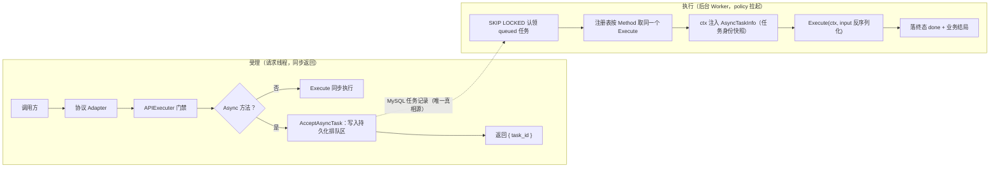
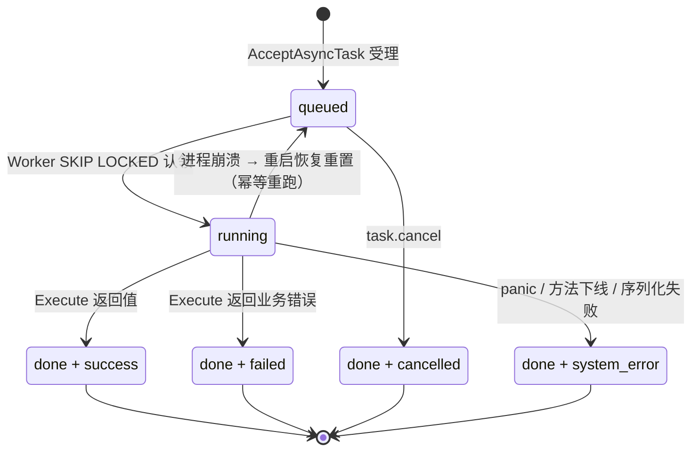

[← 返回 README](../README.md)

<!-- TOC -->

- [1. Task 域定位与边界](#1-task-域定位与边界)
- [2. 业务流转](#2-业务流转)
- [3. 方法契约](#3-方法契约)
    - [3.1. task.get](#31-taskget)
    - [3.2. task.list](#32-tasklist)
    - [3.3. task.cancel](#33-taskcancel)
- [4. 数据与并发纪律](#4-数据与并发纪律)
- [5. 验收边界](#5-验收边界)
- [6. 实现进度](#6-实现进度)

<!-- /TOC -->

# 1. Task 域定位与边界

Task 域负责异步长任务的持久状态、统一受理、后台执行与查询。MySQL 任务记录是唯一真相源，不使用内存 channel、请求 goroutine 或连接存活状态冒充可恢复任务池。运行前提：MySQL 8.0+（认领依赖 `FOR UPDATE SKIP LOCKED`）。

`SupportedMethod.Async` 只由后端方法注册设置，默认同步。受理统一收口在 `APIExecuter`：门禁通过后读取 `Async` 标识，经 `ability_task.AcceptAsyncTask` 写入持久化排队区并立即返回 `task_id`；Policy 后续按空闲名额认领任务，并按方法名调用**同一注册项的同一个 `Execute`**。`Execute` 保持纯业务工作函数，各方法不得自写受理。

# 2. 业务流转

调用流转：



状态三字段（与 model 列 comment、包内常量三处同步维护）：

| 层 | 字段 | 值域 | 唯一写方 |
|---|---|---|---|
| 程序级 | `run_status` | `queued` → `running` → `done`（唯一终态） | 调度器/Worker |
| 业务级 | `process_status` | 空（进行中）/ `success` / `failed` / `cancelled` / `system_error` | Worker 落结局、cancel 落取消 |
| 业务级 | `progress` | 0–100（`progress_message` 为伴随文案） | 业务 Execute 经 `UpdateProgress` |

两层值域零交集；`run_status=done ⟺ process_status 非空`。程序性故障（方法下线、输入/结果序列化失败、Execute panic）落 `system_error`；`Execute` 返回业务错误落 `failed`——排障时一眼分清系统坏了还是业务没通过。**部分成功**不设枚举，由业务在 result 中自描述；**自动重试**不做，重试 = 重新发起新任务。

状态流转：



# 3. 方法契约

受保护方法 wire 必传 `arguments.jwt_token`，由 API 门禁统一验证并消费（验证后即移除），业务层零感知；本文方法签名只列业务参数，入参 schema 权威见 [`api_methods.md`](api_methods.md)。

无属主任务（Public 异步方法产生，`user_id` NULL）不可经下列方法查询或取消。

## 3.1. task.get

查询我的异步任务状态与结果。

```json
{ "task_id": "b3f11655-08df-458f-aa8d-aaa02a20bd51" }
```

- 所有权 `task.user_id == 当前用户`；`success` 时附 result。

## 3.2. task.list

列出我的异步任务。

```json
{}
```

- 我的任务 id DESC，最多 50 条。

## 3.3. task.cancel

取消我的排队中任务。

```json
{ "task_id": "b3f11655-..." }
```

- 仅 `queued` 可取消（原子置 `done + cancelled`）；`running` 与终态拒绝。

# 4. 数据与并发纪律

- **认领**：事务内 `SELECT ... WHERE run_status='queued' ORDER BY id ASC LIMIT 1 FOR UPDATE SKIP LOCKED` → 置 `running` → 提交后才执行。多 Worker 零踩踏，同一任务不可能被认领两次。
- **Worker 并发**：由 Policy 按 `runtime.NumCPU() × policy_cfg.workers_scaller` 计算全局上限；每个 Worker 只认领并执行一条任务，完成后 goroutine 自然释放。
- **排队区**：受理层不设人为的每用户在途数量上限；MySQL 任务记录承载排队，资源故障按正常数据库错误返回。
- 普通状态查询读已提交快照不加锁；并发状态变更一律条件原子更新或行锁事务。共享瓶颈是全局 DB 连接池（Worker 与请求线程共用），池容量属部署参数。
- **任务身份快照**：Worker 把 `AsyncTaskInfo{TaskID, UserID}` 注入 context，业务 `Execute` 经 `AsyncTaskInfoFromContext` 读取——与门禁在线身份语义分离，异步执行不要求受理时的 session 仍存活。
- **执行单元**：Policy 每轮只填充当前空闲名额，长任务持续占用其名额，下一轮不会重复扩容。
- **未尽之事自愈（取代一次性启动恢复）**：`policy` 维护大循环每轮调 `RequeueOrphanedTasks`——DB `running` 且不在本进程 in-flight 执行集合的孤儿任务重置回 `queued` 拉起来继续。重启后第一轮即捞回全部死进程遗留；运行中意外孤儿同样自愈。防误拉：`claimQueuedTask` 在认领事务提交**前**登记 in-flight、任务落终态后移除——DB `running` 可见时执行记录必已存在，无误判窗口。**异步 `Execute` 必须幂等或自查重**——重跑兜底依赖此契约，责任归业务函数。
- **单实例边界**：不做分布式认领/租约；多实例部署是将来的独立命题。
- **载荷**：`input_payload`/`result_payload` 明文 JSON 存储；**敏感值（密码、token、密钥等）不得进入异步方法的 arguments 与结果**（门禁参数 `jwt_token` 已在受理前被 APIExecuter 移除）。持久化加密待真实敏感任务出现时另立契约。

# 5. 验收边界

真实验收必须分别证明：

- Async 方法受理立即返回 `task_id`，Worker 后续执行同一注册项 Execute。
- 多 Worker 并发认领零踩踏（SKIP LOCKED），同一任务不被执行两次。
- 进程杀死后重启，`running` 孤儿任务被重置回 `queued` 并重跑完成。
- `task.cancel` 仅对 `queued` 生效；`running` 与终态拒绝。
- 跨用户 `task.get` / `task.cancel` 被所有权校验拒绝；无属主任务不可查询或取消。

首个真实异步业务方法接入后完成上述端到端验收（仓内禁造演示方法）。

# 6. 实现进度

状态按 `TODO → IN_PROGRESS → DONE → ACCEPTED` 流转；发生争议时进入 `DISPUTED`，对齐后回到 `IN_PROGRESS`。只有 `ACCEPTED` 可以打勾。

本文档随模板携带：实现代码已随模板就位（DONE），真实验收须在实例化项目内按各自环境完成后方可 ACCEPTED。

- [ ] 🟡 DONE — `SupportedMethod.Async` 受理一次性接入 `APIExecuter`（api 层就此封版）。
- [ ] 🟡 DONE — 状态三字段（`run_status`/`process_status`/`progress`）落 model，枚举三处同步。
- [ ] 🟡 DONE — `AcceptAsyncTask` 受理（持久化排队 + 身份快照）。
- [ ] 🟡 DONE — Policy 按 CPU 倍率填充执行名额（SKIP LOCKED 认领、临时 Worker、panic 归 system_error）。
- [ ] 🟡 DONE — 未尽之事自愈：`RequeueOrphanedTasks` 经 `policy` 维护大循环每轮侦测（in-flight 防误拉）。
- [ ] 🟡 DONE — `task.get` / `task.list` / `task.cancel` 带所有权校验接入统一调用链。
- [ ] ⬜ TODO — 首个真实异步业务方法接入后完成受理→执行端到端验收（仓内禁造演示方法）。
- [ ] ⬜ TODO — done 任务的归档/清理策略（保留窗口拍板后作为 `policy` 定期轮询租户实施）。
- [ ] ⬜ TODO — 任务载荷持久化加密契约（待真实敏感任务出现）。
